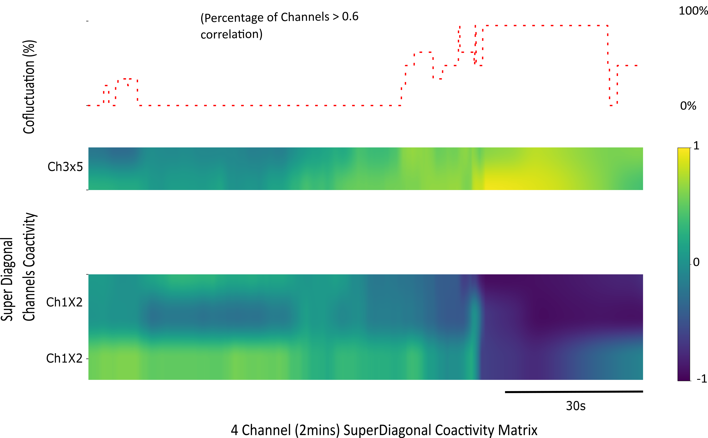

## Running Coact and Cofluctuation Code

The coactivity and cofulctuation codes have been provided for One animal with 4 channels of 2mins surrogate data. The data can be accessed in ./Animal_Data/NeuralOutSpike/Animal_ChannelX/
as .csv files. These .csv files contain the spike time and spike rate. Similar files can be used for spike standard deviation as well. 

The codes can be run in the command line using

```{python}
cd ./CoactivityCofluctuationEventRate/
python runSpikeRateCoact.py
```

The above code computed the coactivity matrix and the cofluctuation series for the 4 channels and stores the results in a folder called 'SpikerateCoact_output_10s_6minbuff_corr_thr_0p6'
inside ./CoactivityCofluctuationEventRate/Animal_Data/. The '.0p6' represents the threshold for the cofluctuation series and '6min' buffer represents the buffer size before and after 
events or interventions found in comment files in ./Animal_Data/CommentFiles. No comment files have been included in the repo for the sake of simplicity. 

The outputs dumped in ./Animal_Data/SpikerateCoact_output_10s_6minbuff_corr_thr_0p6 are 
1. diarySpikerateCoact - Diary of code progress in a text file
2. metadata_SC - Metadata file of parameters used for the run
3. spikerate_AllEventscoact_Animal - Plot of coactivity matrix as .pdf
4. spikerate_AllEventscoact_statsAnimal - .csv file of coflutuation series 
5. spikerate_AllEventscofluctuation_Animal - Plot of cofluctuation Series in .pdf


Detailed Documentation and Pseudocode have been provided in 

```{python}
./cofluctuations_event_generation.rst
```

The ouput for coactivity and cofluctuation for the surrogate data used is plotted as


