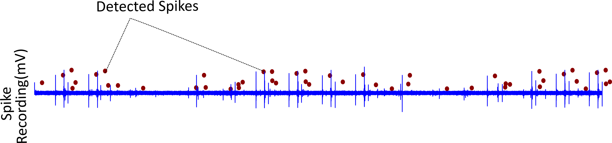

# STEPS TO TEST MULTILEVEL 1

ML1 must be run using the command
        python runMultiLevel1.py > DiaryML1.txt
        
The runs MultiLevel 1 for 2 minute data of two channels of 2 animals. 
A representative example for the 2min spikerecording is given below

Three Output files are generated for a Animalx and Channely multilevel1 run
1. diaryML1_Ax_Channelx - Contains the diary for the multilevel 1 run with the "winning" number of spikes found for each level
2. metadataMultilevel1_Ax_Channelx - Contains the parameters used for the multilevel1 run
3. outputSpike_Ax_Channelx - Contains the location and sign of the detected spikes.

Final iteration of one of the channels is shown below with the detected spikes shown as colored dots

