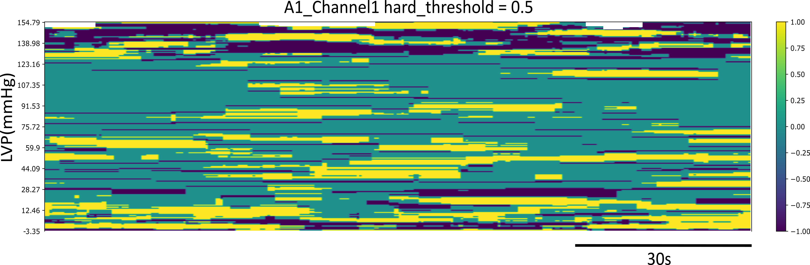

## Running Neural Specificity Code
The neural specificity code has been provided to calculate and generate plots of the metric for the same 2 Animals and 2 channels used in Ml1 and ML2 in the ../Animals Folder
This code requries "Uncurated.csv" from ML2 present in ../Animals/AnimalX/AnimalX_ChannelY/ML2_Output/. 

The steps to run the code in the command line are

```{python}
cd ./NeuralSpecificity
python runAttentionMetric
```
This will create an output folder called 'NeuralSpecificity_20s_6minbuff' in ../Animals/AnimalX/ for each channel AnimalX_ChannelY. The '20s' represents the window width in meric calcuation. This can be changed in as a hyper parameter in the code depending on the duration of the spike recording. A window width of 20 minutes has been used in the paper for 6-8 hours spike recordings. The '6minbuff' represnets the buffer time before and after any events or interventions in the experiment toplot the metric. For the sake of simplicity, only a 2 min recording with no events (empty comment file folder) have been shown in the repo. 

The outputs dumped in the ../Animals/AnimalX/NeuralSpecificity_20s_6minbuff/AnimalX_ChannelY are
1. diaryAMA1_Channel1 - Diary of code progress 
2. image_A1_Channel1_Attention_AllEventsMetric_relative_LVP_50 - Attention Metric plot
3. image_A1_Channel1_Attention_AllEventsRandom_Metric_relative_LVP_50 - Attention Random Plot
4. image_A1_Channel1_Attention_AllEventsSample_Metric_relative_LVP_50 - Attention Sample Plot
5. metadata_AttentionMetricA1_Channel1 - Matadata containing parameters used in the run
6. AllEvents_shannon_entropy - Entropy .csv file for analysis


Detailed Documentation and Pseudocode have been provided in 

```{python}
./neural_specificity_entropy.rst
```

The output of the metric calculated and plotted for one channel of surrogate data is 


